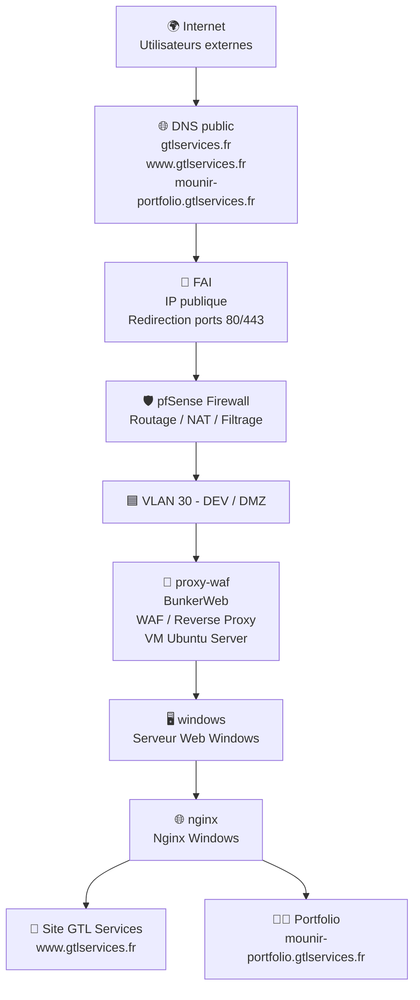

# 🛡️ DMZ_WEB — Hébergement local sécurisé

## 📌 Présentation

**DMZ_WEB** est une infrastructure d’hébergement local sécurisé mise en place dans mon HomeLab.

L’objectif est d’héberger mes services web, notamment :

- Le site principal **GTL Services**
- Mon **portfolio personnel**

L’architecture repose sur une séparation réseau avec une zone DMZ, protégée par un pare-feu pfSense et un WAF / reverse proxy BunkerWeb.

## 🧭 Architecture réseau

## 🔐 Objectifs

- Héberger localement des services web publics
- Isoler les services exposés dans une DMZ
- Protéger les applications web avec un WAF
- Centraliser les flux HTTP/HTTPS via un reverse proxy
- Appliquer une logique de filtrage avec pfSense
- Reproduire une architecture proche d’un environnement professionnel

---

## 🧱 Rôles des composants

| Composant | Rôle |
|-----------|------|
| **FAI** | Fournisseur d’accès Internet et redirection des flux web |
| **pfSense** | Pare-feu, routage, NAT, filtrage réseau |
| **VLAN 30 - DEV / DMZ** | Zone réseau isolée dédiée aux services exposés |
| **proxy-waf / BunkerWeb** | WAF et reverse proxy pour protéger les applications |
| **windows** | Serveur hébergeant les services web |
| **nginx** | Serveur web pour GTL Services et le portfolio |
| **linuxserver** | Services web, base de données et outils applicatifs |
| **VMware** | Plateforme de virtualisation utilisée pour l’infrastructure |

---

## 🌐 Services hébergés

| Service | Domaine |
|----------|----------|
| **GTL Services** | `www.gtlservices.fr` |
| **Portfolio** | `mounir-portfolio.gtlservices.fr` |

---

## 🛠️ Technologies utilisées

- pfSense
- BunkerWeb
- Nginx
- Windows
- Linux Server
- VMware
- MySQL
- PHP

---

## 🎓 Compétences mises en œuvre

### Réseau

- Segmentation réseau par VLAN
- Routage inter-réseaux
- NAT et redirection de flux
- Gestion des flux entrants et sortants
- Publication de services web vers Internet

### Sécurité

- Mise en place d'une DMZ
- Configuration d'un pare-feu pfSense
- Déploiement d'un WAF avec BunkerWeb
- Reverse Proxy HTTP/HTTPS
- Filtrage et contrôle des accès
- Sécurisation des services exposés

### Systèmes

- Administration Windows
- Administration Linux Ubuntu Server
- Hébergement de services web
- Gestion des services réseau
- Virtualisation avec VMware

### Web

- Hébergement de sites web
- Configuration Nginx
- Gestion PHP
- Gestion MySQL
- Reverse Proxy multi-sites

### Supervision

- Protection collaborative avec CrowdSec
- Gestion des accès d'administration
- Maintenance d'une infrastructure auto-hébergée

---
